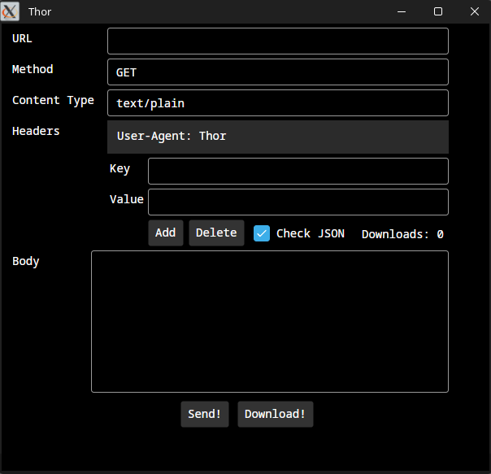

# Thor
GUI HTTP Client written in C# using the Avalonia Framework

## What is this project about?
Thor aims to be a simple and minimalist GUI HTTP Client. 

More user-friendly than CLI HTTP Clients but not as packed with features as many GUI HTTP Clients.



## Cloning & Building
You will need .NET 10.0 SDK as well as Git.

```bash
git clone https://github.com/Moritisimor/Thor
cd Thor/Thor
dotnet publish
```

You can also build the executable for a single file by running the following command:
```bash
dotnet publish -p:PublishSingleFile=true
```

Keep in mind that this will bundle a .NET Runtime with the executable, which can increase its size by a lot.

The compiled artifact will be located in the `bin/Release/net10.0/publish` directory.

## Usage
Once built, you can start the application by running the executable located in `bin/Release/net10.0/publish`.

The executable is called `Thor` or `Thor.exe` if you are running on Windows.

You should be familiar with the HTTP protocol.

The Check JSON checkbox is only active if the Content-Type is set to contain `json`, most commonly `application/json`.

Otherwise, it will not check the JSON body.

The send-button is used for simply sending an HTTP Request and displaying response data in a separate window.

The download-button is used for downloading the response body to a file.
